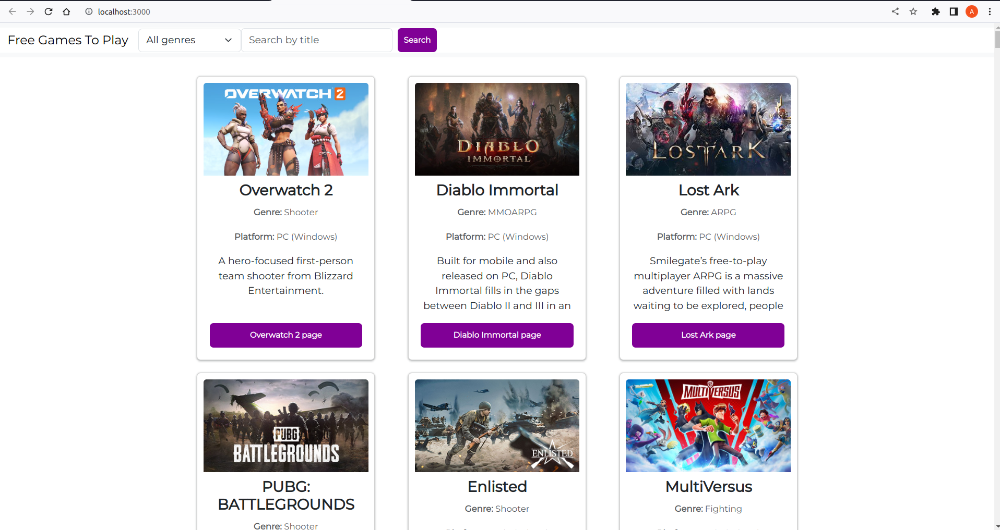
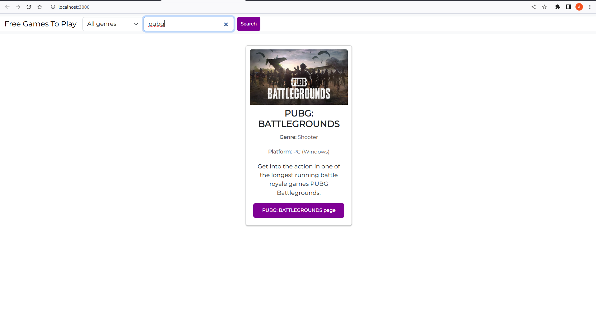
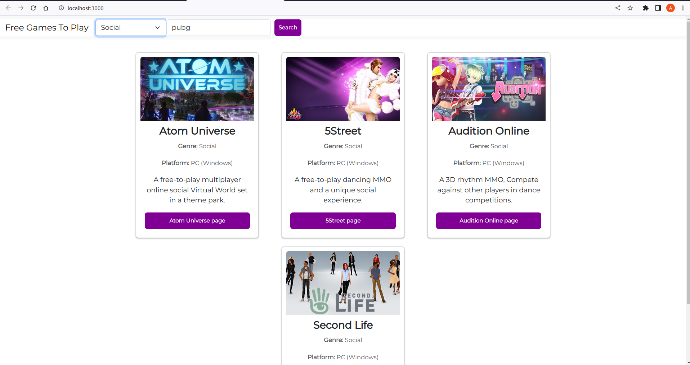

# Lista de jogos gratuitos

Este projeto consiste em uma lista de jogos gratuitos, onde o usuário pode filtrar os jogos por gênero através de um menu suspenso (select) ou pesquisar pelo título do jogo utilizando um formulário de pesquisa.

## Bibliotecas utilizadas

- React.js: uma biblioteca JavaScript de código aberto que é amplamente utilizada para criar interfaces de usuário em aplicações web.
- React Toastify: uma biblioteca para exibir notificações elegantes e responsivas em um aplicativo React. É útil para fornecer feedback visual ao usuário.
