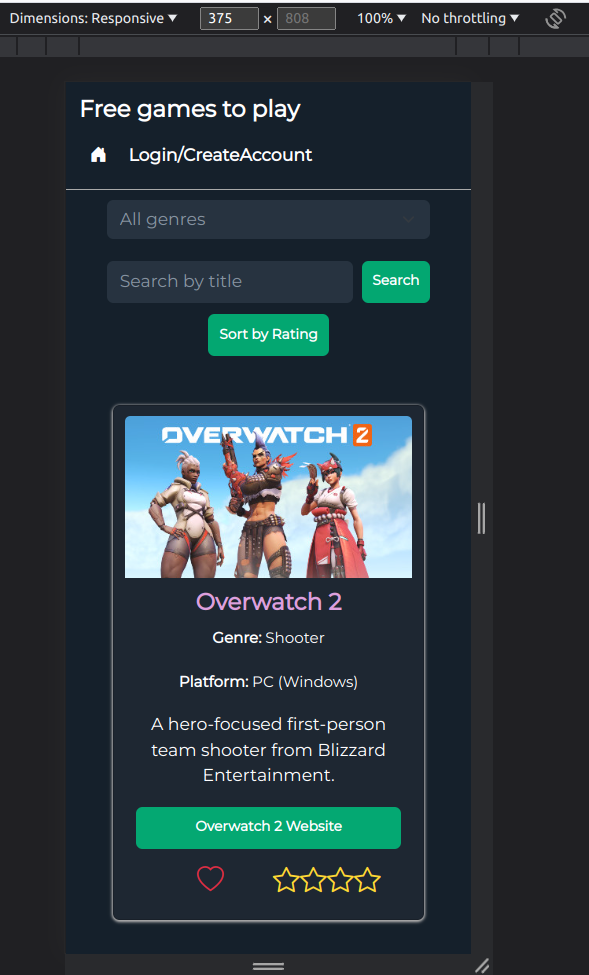
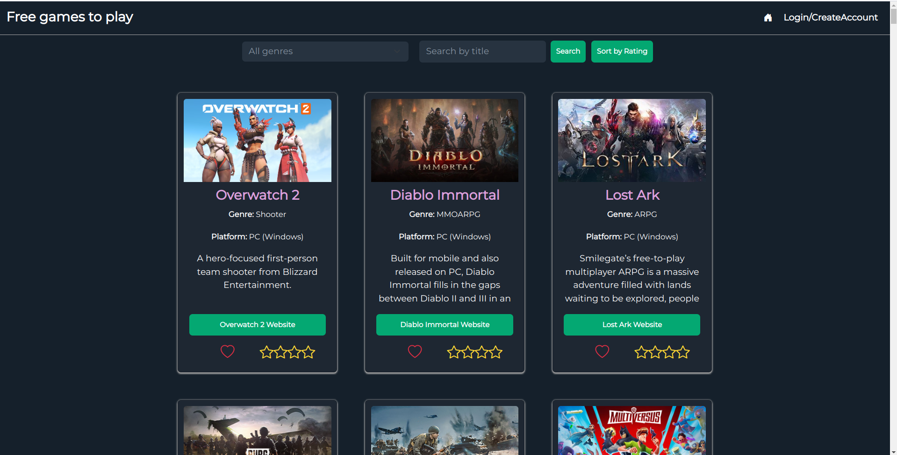
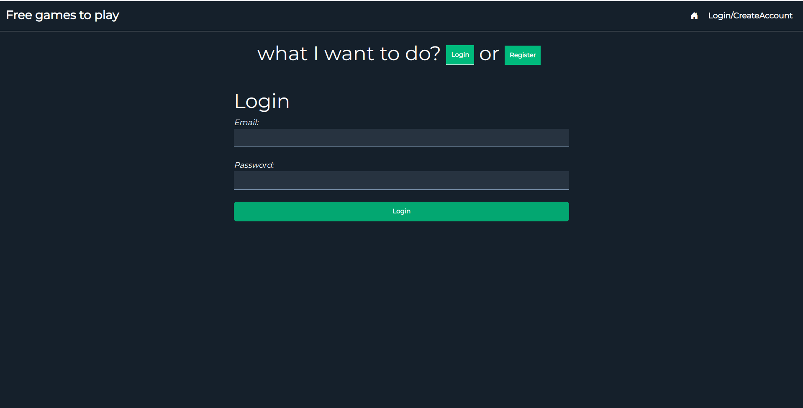
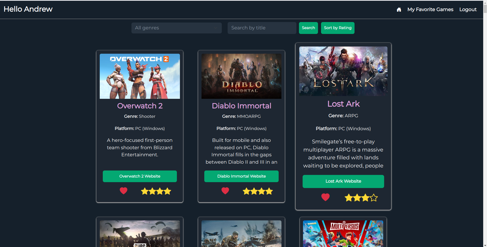

# Nova versão do Epic Free Games

Este é o repositório da nova versão do Epic Free Games, uma plataforma onde os usuários podem descobrir, favoritar e avaliar jogos gratuitos. Você pode acessar o projeto [aqui](https://gamelist-ebon.vercel.app/).

## Novas funcionalidades adicionadas

A nova versão do Epic Free Games possui as seguintes funcionalidades:

1. **Cadastro e login seguros**: Agora os usuários podem criar uma conta e fazer login de forma segura para acessar recursos exclusivos.

2. **Favoritar e avaliar jogos**: Os usuários podem favoritar os jogos que mais gostam.

3. **Tela de jogos favoritados**: Os jogos favoritados pelos usuários serão exibidos em uma tela dedicada, permitindo que eles acessem facilmente seus jogos preferidos.

## Capturas de tela

Aqui estão algumas capturas de tela da nova versão do Epic Free Games:

_Captura 1: Tela principal para dispositivos móveis._

_Captura 2: Tela principal para computadores._

_Captura 3: Tela de login._

_Captura 4: Tela principal com o usuário logado._

## Bibliotecas e tecnologias utilizadas

O projeto foi desenvolvido utilizando as seguintes bibliotecas e tecnologias:

- **React.js**: Uma biblioteca JavaScript de código aberto amplamente utilizada para criar interfaces de usuário em aplicações web.

- **React Toastify**: Uma biblioteca que permite exibir notificações elegantes e responsivas em um aplicativo React. É útil para fornecer feedback visual ao usuário.

- **Firebase**: Uma plataforma de desenvolvimento de aplicativos móveis e web que fornece serviços de backend como autenticação, armazenamento de dados em tempo real, hospedagem e muito mais.

- **Bootstrap e Bootstrap Icons**: Framework CSS popular que facilita o desenvolvimento de interfaces responsivas e estilizadas. Os ícones do Bootstrap Icons são usados para fornecer uma experiência visual agradável.

- **React Router Dom**: Uma biblioteca de roteamento para React que permite navegar entre diferentes componentes React de forma fácil e declarativa.

- **Validator**: Uma biblioteca para validação de dados em formulários, garantindo que as informações inseridas pelos usuários atendam aos critérios definidos.

Sinta-se à vontade para explorar o projeto e desfrutar da nova experiência de descoberta de jogos gratuitos no Epic Free Games.
